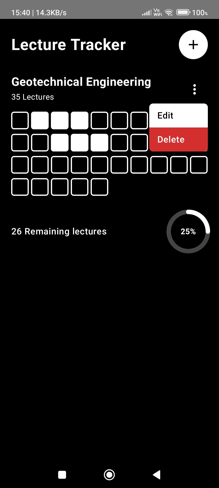
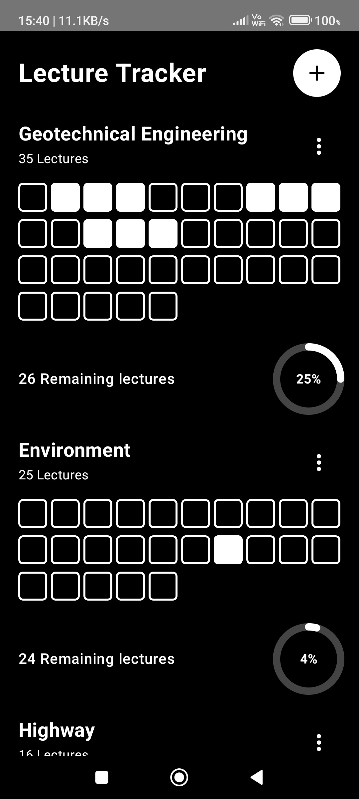

# Lecture Tracker

A simple Android application for tracking lecture progress on a
subject-wise basis.

Lecture Tracker allows students to enter a subject name and the total
number of lectures. The app automatically generates a visual lecture
tracker and calculates the completion percentage as lectures are marked
or unmarked.

## Features

-   Add subjects with a custom subject name
-   Set the total number of lectures for each subject
-   Automatically generate lecture tracking boxes
-   Mark lectures as completed or uncompleted
-   Automatically calculate lecture completion percentage
-   Display remaining lectures
-   Visualize progress using a donut chart
-   Edit existing subjects
-   Delete subjects
-   Simple and minimal user interface
-   Designed for student lecture and progress tracking

## How It Works

1.  Add a subject using the `+` button.
2.  Enter the subject name.
3.  Enter the total number of lectures.
4.  The app automatically generates the required lecture tracking boxes.
5.  Mark a lecture as completed by selecting its corresponding box.
6.  The completion percentage and remaining lectures update
    automatically.

### Completion Formula

**Completion Percentage = (Completed Lectures / Total Lectures) × 100**

Where:

-   **Completed Lectures** = Number of lectures marked as completed
-   **Total Lectures** = Total number of lectures entered for the
    subject

The number of remaining lectures is calculated as:

**Remaining Lectures = Total Lectures − Completed Lectures**

## Screenshots

<p align="center">
  
  
</p>

The app displays each subject along with its total lectures, remaining
lectures, and completion percentage.

## Tech Stack

-   **Language:** Kotlin
-   **UI:** Jetpack Compose
-   **Design:** Material 3
-   **Build System:** Gradle
-   **Java:** Java 11
-   **Minimum Android Version:** Android 7.0 (API 24)
-   **Target SDK:** 37
-   **Compile SDK:** 37

## Project Structure

``` text
LectureTracker/
├── app/
│   └── src/
│       └── main/
│           ├── java/
│           ├── res/
│           └── AndroidManifest.xml
│
├── apk/
│   └── LectureTracker.apk
│
├── assets/
│   └── app-icon.png
│
├── screenshots/
│   ├── home.png
│   └── multiple-subjects.png
│
├── gradle/
├── .gitignore
├── build.gradle.kts
├── gradle.properties
├── gradlew
├── gradlew.bat
└── settings.gradle.kts
```

## Download

[**Download LectureTracker APK**](apk/LectureTracker.apk)

## Installation

1.  Download the APK from the link above.
2.  Transfer it to an Android device if necessary.
3.  Open the APK file.
4.  Allow installation from the required source if prompted.
5.  Install and launch Lecture Tracker.

## Android Compatibility

The application supports Android devices running **Android 7.0 (API 24)
or later**.

## Version

-   **Version:** 1.0
-   **Version Code:** 1

## License

This project is currently available for personal and educational use.

## Author

**Shivang Sagar**

[GitHub Profile](https://github.com/shivangsagar)
